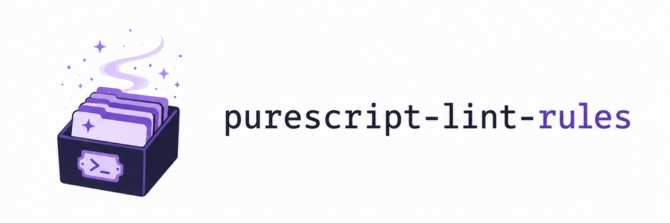

<p>
  <picture>
    <source media="(prefers-color-scheme: dark)" srcset="assets/logo-dark.png">
    
  </picture>
</p>

[](https://github.com/m-bock/purescript-lint-rules/actions/workflows/ci.yml)

A set of general-purpose lint rules for the
[`purescript-lint`](https://github.com/m-bock/purescript-lint) engine.

Each rule is a value; its setting arrives where it joins a rule set.

```purescript
import Lint.Rules.Naming.NoStutteringName (noStutteringName)
import Lint.Rules.Size.MaxFunctionArity (maxFunctionArity)
import Lint.RuleSet.Do (rule)
import Lint.RuleSet.Do as Rules

rules :: Array Rule
rules = Rules.do
  rule $ perDecl maxFunctionArity 4
  rule $ perModule_ noStutteringName
```

<!-- RULES -->

## Naming

### ● `no-stuttering-name`

Flags a qualified name whose own name repeats its qualifier.

```purescript
-- good
Parser.Token

-- bad
Parser.ParserToken
```

## Nesting

### ● `max-delimiter-run`

Flags more than the configured number of brackets opening or closing in immediate succession.

Read against `a run of 2`.

```purescript
-- good
f $ g (h (i x))

-- bad
f (g (h (i x)))
```

### ● `max-lambda-nesting-depth`

Flags a lambda nested anywhere inside more than the configured number of enclosing lambdas.

Read against `a depth of 2`.

```purescript
-- good
\xs -> map (\x -> f x) xs

-- bad
\xs -> map (\x -> filter (\y -> p y) x) xs
```

## Height

### ● `max-declaration-lines`

Flags a top-level declaration whose own source line span exceeds the configured maximum.

Read against `5 lines`.

```purescript
-- good
report r = header r <> body r

-- bad
report r =
  let
    h = header r
    b = body r
  in
    h <> b
```

## Width

### ● `max-line-length`

Flags a line over the configured width - a type signature gets its own, wider allowance than ordinary code.

Read against `{ code: 100, signature: 150 }`.

```purescript
-- good
describe x =
  "value: " <> show x
    <> " (" <> show (length x) <> " items, "
    <> show (total x) <> " in all)"

-- bad
describe x = "value: " <> show x <> " (" <> show (length x) <> " items, " <> show (total x) <> " in all)"
```

## Size

### ● `max-function-arity`

Flags a top-level definition binding more parameters than the configured maximum. Counts the binders written in the equation, which need not match the arrows in its type.

Read against `max arity 3`.

```purescript
-- good
resize { width, height, quality } img = img

-- bad
resize width height quality img = img
```

<!-- /RULES -->

## Licence

MIT.
